Analysis
================
Jeremy Albright
Nov 09, 2022

## Preliminaries

This git repository contains the code used to prepare the data for the
xgboost models and validate the predictions. The data for Michigan
hospitals were provided to BMC2 by the National Cardiovascular Data
Registry (NCDR) from their CathPCI registry. BMC2 runs its own scripts
to convert the NCDR production into its own data tables used for
reporting. The data cleaning steps described below are based on these
BMC2-specific data tables, which cannot be shared due to considerations
of data licensing and patient privacy. The cleaning steps are included
to provide transparency in coding decisions but cannot be applied to
directly to NCDR data productions.

Read in the data.

``` r
tbl <- readRDS("../bmc2-joined-pci-data.rds")
```

## Data Cleaning

``` r
tbl <- tbl %>% 
  mutate(
    across(
      c(dyslipidemia, family_hx_cad, current_dialysis, prior_pci, prior_cabg,
        prior_cvd, hxcld, hxmi, prior_pad, hxdiab, tobaccouse, tobaccotype, 
        tobaccoamt, caouthospital, cawitness, capostems, initcarhythm, 
        cshascale, stress_imaging, stress_echo_result, exercise_stress_test_result,
        stress_image_cmr_result, stress_nuclear_result, stress_echo_risk,
        exercise_stress_test_risk, stress_image_cmr_risk, stress_nuclear_risk,
        nvstenosis, diagcorangio, status, mvd, thrombolytics, syntaxscore,
        pci_delay_reason, hxhf, priornyha, hfnewdiag, hftype, cardiaccta,
        cardiacctares, priordxangioproc, priordxangiores, leftheartcath, cainhosp, cvinstability,
        valvdst1,  valvdst2, valvdst3, valvdst4, stensev1, stensev2, stensev3,
        stensev4, valvdrt1, valvdrt2, valvdrt3, valvdrt4, regusev1, regusev2,
        regusev3, regusev4, preopeval, funccapacity, funccapacityunk, surgrisk,
        organtransplantsurg, field_d_afib_value, field_d_diabetes_tx_value,
        cardiac_arrest_any, CA_level_of_consciousness),
      ~na_if(.x, "NA")
    )
  )


#-------- Height and weight
tbl <- tbl %>% 
  mutate(
    height_NA = as.integer(is.na(height)),
    weight_NA = as.integer(is.na(weight))
  ) %>% 
  mutate(
    height = as.numeric(height),
    weight = as.numeric(weight)
  )


#------ Ventricular Support
tbl <- tbl %>% 
  mutate(
    ventricular_support = case_when(
      !vasopressor_support & !mechanical_support ~ 0L,
      !vasopressor_support & mechanical_support  ~ 1L,
      vasopressor_support  & !mechanical_support ~ 2L,
      TRUE                                       ~ 3L
    ) %>% factor(levels = 0:3, labels = c("No Ventricular Support or Unknown",
                                          "Mechanical Support",
                                          "Vasopressor Support",
                                          "Both Mechanical and Vasopressor Support"))
  )


#-------- Collapse cshascale
tbl <- tbl %>% 
  dplyr::rename(
    cshascale_old = cshascale
  ) %>% 
  mutate(
    cshascale = case_when(
      str_detect(cshascale_old, "1|2") ~ "1-2: Very Fit or Well",
      str_detect(cshascale_old, "3")   ~ "3: Managing Well",
      str_detect(cshascale_old, "4")   ~ "4: Vulnerable",
      str_detect(cshascale_old, "5")   ~ "5: Mildly Frail",
      str_detect(cshascale_old, "6")   ~ "6: Moderately Frail",
      str_detect(cshascale_old, "7")   ~ "7: Severely Frail",
      str_detect(cshascale_old, "8|9") ~ "8-9: Very Sev. Frail or Terminally Ill",
      TRUE                             ~ NA_character_
    ) %>% as.factor()
  )


#-------- Clean up Status
tbl <- tbl %>% 
  rename(
    status_old = status
  ) %>% 
  mutate(
    status = case_when(
      status_old == "elective" ~ 0L,
      status_old == "emergent" ~ 1L,
      status_old == "urgent"   ~ 2L,
      status_old == "salvage"  ~ 3L,
      TRUE                 ~ NA_integer_
    ) %>% 
      factor(levels = 0:3, labels = c("Elective",
                                      "Emergent",
                                      "Urgent",
                                      "Salvage"))
  )


#-------- Clean Diabetes
tbl <- tbl %>% 
  mutate(
    diab_tx = case_when(
      field_d_diabetes_tx_value == "No DM" ~ 0L,
      field_d_diabetes_tx_value == "IDDM"  ~ 1L,
      field_d_diabetes_tx_value == "NIDDM" ~ 2L,
      TRUE ~ NA_integer_
  ) %>% factor(levels = 0:2, labels = c("No Diabetes", "Diabetes - IDDM", "Diabetes - NIDDM"))
)


#-------- Differentiate missing NYHA from no prior heart failure
tbl <- tbl %>% 
  dplyr::rename(
    priornyha_old = priornyha
  ) %>% 
  mutate(
    priornyha = case_when(
      hxhf == "0"                         ~ "No Hx Heart Failure",
      hxhf == "1" & !is.na(priornyha_old) ~ as.character(priornyha_old),
      TRUE                                ~ NA_character_
    ) %>% factor(levels = c("No Hx Heart Failure",
                            "Class I",
                            "Class II",
                            "Class III",
                            "Class IV"))
  ) 


#-------- Differentiate missing type from no hx heart failure
tbl <- tbl %>% 
  dplyr::rename(
    hftype_old = hftype
  ) %>% 
  mutate(
    hftype = case_when(
      hxhf == "0"                      ~"No Hx Heart Failure",
      hxhf == "1" & !is.na(hftype_old) ~ as.character(hftype_old),
      hxhf == "1"                      ~ "Heart Failure Type Not Documented",
      TRUE                             ~ NA_character_
    ) %>% factor(levels = c("No Hx Heart Failure",
                            "Diastolic heart failure",
                            "Systolic Heart Failure",
                            "Heart Failure Type Not Documented"))
  )


#-------- Tobacco Use and Amount
tbl <- tbl %>% 
  dplyr::rename(
    tobaccouse_old = tobaccouse
  ) %>% 
  mutate(
    tobaccouse = case_when(
      str_detect(tobaccouse_old, "every") & str_detect(tobaccoamt, "Heavy") ~ "Current Every Day User",
      str_detect(tobaccouse_old, "every") & str_detect(tobaccoamt, "Light") ~ "Current Every Day User",
      str_detect(tobaccouse_old, "every")                                   ~ "Current Every Day User",
      str_detect(tobaccouse_old, "some day")                                ~ "Current Some Day User",
      str_detect(tobaccouse_old, "Former")                                  ~ "Former User",
      str_detect(tobaccouse_old, "Never")                                   ~ "Never Used Tobacco",
      TRUE                                                                  ~ NA_character_
    ) %>% factor(levels = c("Never Used Tobacco",
                            "Former User",
                            "Current Some Day User",
                            "Current Every Day User"))
  )


#-------- Collapse PCI Indication
tbl <- tbl %>% 
  dplyr::rename(
    pci_indication_old = pci_indication
  ) %>% 
  mutate(
    pci_indication = case_when(
      str_detect(pci_indication_old, "STEMI") ~ "STEMI",
      pci_indication_old == "NA"              ~ NA_character_,
      TRUE                                    ~ as.character(pci_indication_old)
    ) %>% as.factor()
  ) 


#-------- Cardiogenic Shock
tbl <- tbl %>% 
  mutate(
    cardiogenic_shock = case_when(
      str_detect(cvinstabilitytype, "Cardiogenic Shock") ~ 1L,
      TRUE ~ 0L)
  )


#-------- Stress Imaging: Differentiate Missing from No Test.
tbl <- tbl %>% 
  dplyr::rename(
    stress_imaging_old = stress_imaging,
    stresstest_old     = stresstest
  ) %>% 
  mutate(
    stress_imaging = case_when(
      stresstest_old == "0" & is.na(stress_imaging_old) ~ "No Stress Testing",
      stresstest_old == "1" & is.na(stress_imaging_old) ~ "Stress Test: No Imaging Recorded",
      stresstest_old == "1" & stress_imaging_old == "1" ~ "Stress Test Imaging",
      TRUE                                              ~ NA_character_
    ) %>% as.factor()
  )


#-------- Collapse Stress Tests.

tbl <- tbl %>% 
  mutate(
    stresstest = case_when(
      stresstest_old == "0"       ~ "No Stress Test",
      stress_echo == "1"          ~ "Stress Echocardiogram",
      exercise_stress_test == "1" ~ "Exercise Stress Test",
      stress_nuclear == "1"       ~ "Stress Nuclear",
      stress_image_cmr == "1"     ~ "Stress Image CMR",
      stresstest_old == "1"       ~ "Stress Test (Type Not Indicated)",
      TRUE                        ~ NA_character_
    ) %>% factor(levels = c("No Stress Test",
                            "Exercise Stress Test",
                            "Stress Echocardiogram",
                            "Stress Image CMR",
                            "Stress Nuclear",
                            "Stress Test (Type Not Indicated)"))
  )

#-------- Collapse Stress Test Results.
tbl <- tbl %>% 
  mutate(
    stress_test_result = case_when(
      stresstest_old == "0"               ~ "No Stress Testing",
      !is.na(stress_echo_result)          ~ as.character(stress_echo_result),
      !is.na(exercise_stress_test_result) ~ as.character(exercise_stress_test_result),
      !is.na(stress_image_cmr_result)     ~ as.character(stress_image_cmr_result),
      !is.na(stress_nuclear_result)       ~ as.character(stress_nuclear_result),
      stresstest_old == "1"               ~ "Unavailable",
      TRUE                                ~ NA_character_
    ) %>% factor(levels = c("No Stress Testing",
                            "Negative",
                            "Positive",
                            "Indeterminate",
                            "Unavailable"))
  )


#-------- Collapse Stress Test Risk.
tbl <- tbl %>% 
  mutate(
    stress_test_risk = case_when(
      stresstest_old == "0"             ~ "No Stress Testing",
      !is.na(stress_echo_risk)          ~ as.character(stress_echo_risk),
      !is.na(exercise_stress_test_risk) ~ as.character(exercise_stress_test_risk),
      !is.na(stress_image_cmr_risk)     ~ as.character(stress_image_cmr_risk),
      !is.na(stress_nuclear_risk)       ~ as.character(stress_nuclear_risk),
      stresstest_old == "1"             ~ "Unavailable",
      TRUE                              ~ NA_character_
    ) %>% factor(levels = c("No Stress Testing",
                            "Low Risk of Ischemia",
                            "Intermediate Risk of Ischemia",
                            "High",
                            "Unavailable"))
  )

#-------- Update stress_test_result
tbl <- tbl %>%
  rename(
    stress_test_result_old = stress_test_result
  ) %>% 
  mutate(
    stress_test_result = case_when(
      stress_test_result_old == "No Stress Testing" ~ "No Stress Testing",
      stress_test_result_old == "Negative" ~ "Negative",
      stress_test_result_old == "Positive" & stress_test_risk == "Low Risk of Ischemia" ~ "Positive - Low Risk of Ischemia",
      stress_test_result_old == "Positive" & stress_test_risk == "Intermediate Risk of Ischemia" ~ "Positive - Intermediate Risk of Ischemia",
      stress_test_result_old == "Positive" & stress_test_risk == "High" ~ "Positive - High Risk of Ischemia",
      stress_test_result_old == "Positive" ~ "Positive - Risk Unknown",
      stress_test_result_old %in% c("Indeterminate", "Unavailable") ~ "Indeterminate/Unavailable",
      TRUE ~ NA_character_
    ) %>% factor(
    levels = c("No Stress Testing",
               "Negative",
               "Positive - Low Risk of Ischemia",
               "Positive - Intermediate Risk of Ischemia",
               "Positive - High Risk of Ischemia",
               "Positive - Risk Unknown",
               "Indeterminate/Unavailable")
  )
)


#------ Race
tbl <- tbl %>% 
  mutate(
    race = case_when(
    White == 1 & `Black/African American` == 0 & Asian == 0 ~ 0L,
    White == 0 & `Black/African American` == 1 & Asian == 0 ~ 1L,
    White == 0 & `Black/African American` == 0 & Asian == 1 ~ 2L,
    !is.na(White) & !is.na(`Black/African American`) & !is.na(Asian) ~ 3L,
    TRUE ~ 4L
    ) %>% factor(levels = 0:4,labels = c("White", "Black/African American", "Asian", "Other or Multiple Races", "NA"))
  ) 


#------ Convert to Numeric
tbl <- tbl %>%  
  mutate(
    across(c(preproctni, lipidshdl, lipidstc, procsystolicbp, hgb, preproccreat), as.numeric)
  ) %>% 
  mutate(
    across(c(chronic_lung_dx, prior_pci, prior_cabg, prior_pad, hypertension, dyslipidemia,
             cvinstability, hxmi, leftheartcath, prior_cvd), as.integer)
  ) %>% 
  mutate(
    across(c(sex, cardiac_arrest_any), as.factor)
  )


#------ New CABG
tbl <- tbl %>%  
  mutate(
    new_cabg = case_when(
      str_detect(cabgstatus, "CABG") & cabgindication %in% c("PCI Failure", "PCI complication") ~ 1L,
      TRUE ~ 0L
    )
  )


#-------- LVEF closes to procedure
tbl <- tbl %>% 
  mutate(
    pre_lvef = case_when(
      !is.na(prepcilvef)  ~ as.numeric(prepcilvef),
      !is.na(preproclvef) ~ as.numeric(preproclvef),
      TRUE ~ NA_real_
    )
  ) %>% 
  mutate(
    pre_lvef_NA = as.integer(is.na(pre_lvef))
  )


#-------- Additional Missing Flags
tbl <- tbl %>% 
  mutate(
    lipidshdl_NA = as.integer(is.na(lipidshdl)),
    lipidstc_NA  = as.integer(is.na(lipidstc)),
    hgb_NA       = as.integer(is.na(hgb)),
    preproctni_NA = as.integer(is.na(preproctni))
  ) 


#-------- Clean outcomes
tbl <- tbl %>% 
  rename(
    aki_old                = AKI,
    death_old              = death,
    any_stroke_old         = any_stroke,
    ischemic_stroke_old    = ischemic_stroke,
    hemorrhagic_stroke_old = hemorrhagic_stroke,
    major_bleeding_old     = major_bleeding,     
    transfusion_old        = post_trans,
    nrd_old                = nrd
  ) %>% 
  mutate(
    aki                = as.integer(aki_old),
    mortality          = as.integer(death_old),
    any_stroke         = as.integer(any_stroke_old),
    ischemic_stroke    = as.integer(ischemic_stroke_old),
    hemorrhagic_stroke = as.integer(hemorrhagic_stroke_old),
    major_bleeding     = as.integer(major_bleeding_old),
    transfusion        = as.integer(transfusion_old),
    nrd                = as.integer(nrd_old)
  )
```

Limit to variables of interest.

``` r
tbl <- tbl %>%
  dplyr::select(
    # Variables used for summary stats only
    visitoccurrencekey, race, hxmi, prior_pci, prior_cabg, prior_pad, hypertension, dyslipidemia, chronic_lung_dx,
    contrast_volume, access_site, cardiogenic_shock,
    # Variables to be kept for model
    age, height, weight, preproccreat, lipidshdl, lipidshdl_NA, lipidstc, lipidstc_NA,
    procsystolicbp, hgb_NA, hgb, cvinstability, sex, ventricular_support, cshascale, status,
    diab_tx, priornyha, hftype, tobaccouse, cardiac_arrest_any, leftheartcath,
    prior_cvd, pci_indication, cath_lab_indication_1, cath_lab_indication_2, cath_lab_indication_5, 
    cath_lab_indication_6,cath_lab_indication_7, cath_lab_indication_8, cath_lab_indication_10, 
    cath_lab_indication_11, cath_lab_indication_13, cath_lab_indication_14, cath_lab_indication_15,
    stress_test_result, pre_lvef, pre_lvef_NA,  
    aki, ischemic_stroke, any_stroke, hemorrhagic_stroke, major_bleeding, 
    transfusion, mortality, nrd, new_cabg) 
```

## Imputation

Now perform kNN imputation (k = 5). AKI has 9.7% missing. Rather than
impute, the corresponding analysis will subset to the observed cases.
NRD also has missing, and major bleed is missing whenever pre procedure
hemoglobin values were missing. Also drop the variables not used in the
model.

Due to the length of time the imputations take, run this chunk once and
save the results, then set `eval = F`.

``` r
set.seed(12345)

impute_vars <- colnames(tbl)[!colnames(tbl) %in% c("aki", "nrd", "major_bleeding", "visitoccurencekey")]

tbl_imp <- tbl %>% 
  kNN(
    variable = impute_vars,
    imp_var  = F
  )

tbl %>% 
  mutate(
    across(aki:new_cabg, ~factor(.x, levels = 0:1, labels = c("No", "Yes")))
  ) %>% 
  saveRDS(
    "../reduced-df-all-outcomes.rds"
  )

tbl_imp %>% 
  mutate(
    across(aki:new_cabg, ~factor(.x, levels = 0:1, labels = c("No", "Yes")))
  ) %>%
  saveRDS(
    "../imputed-reduced-df-all-outcomes.rds"
  )
```

``` r
tbl_imp <- readRDS("../imputed-reduced-df-all-outcomes.rds")
```

## Summary Statistics

Start with features. Use pre-imputed data.

``` r
features_tbl <- tibbletest::descriptives(
  tbl, 
  variables = c(
    race, hxmi, prior_pci, prior_cabg, prior_pad, hypertension, dyslipidemia, chronic_lung_dx,
    age, height, weight, preproccreat, lipidshdl, lipidshdl_NA, lipidstc, lipidstc_NA,
    procsystolicbp, hgb_NA, hgb, cvinstability, sex, ventricular_support, cshascale, status,
    diab_tx, priornyha, hftype, tobaccouse, cardiac_arrest_any, leftheartcath,
    prior_cvd, pci_indication, cath_lab_indication_1, cath_lab_indication_2, cath_lab_indication_5, 
    cath_lab_indication_6,cath_lab_indication_7, cath_lab_indication_8, cath_lab_indication_10, 
    cath_lab_indication_11, cath_lab_indication_13, cath_lab_indication_14, cath_lab_indication_15,
    stress_test_result, pre_lvef, pre_lvef_NA)
) %>% 
  filter(
    !Label %in% c("FALSE", "0", "No")
  ) %>% 
  var_labels(Variable) %>% 
  mutate(
    Label = if_else(Label %in% c("TRUE", "1", "Yes"), "", Label),
    Variable = if_else(Variable != lag(Variable) | row_number() == 1L, Variable, "")
  ) 

features_tbl %>% 
  kable()
```

| Variable                                               | Label                                               | Statistics      |
|:-------------------------------------------------------|:----------------------------------------------------|:----------------|
| Race                                                   | Asian                                               | 1278 (1.19%)    |
|                                                        | Black/African American                              | 9689 (8.99%)    |
|                                                        | NA                                                  | 1878 (1.74%)    |
|                                                        | Other or Multiple Races                             | 5118 (4.75%)    |
|                                                        | White                                               | 89830 (83.34%)  |
| Hx MI                                                  |                                                     | 34745 (32.25%)  |
| Prior PCI                                              |                                                     | 48470 (45.01%)  |
| Prior CABG                                             |                                                     | 17054 (15.83%)  |
| Prior Peripheral Arterial Disease                      |                                                     | 15146 (14.06%)  |
| Hypertension                                           |                                                     | 93047 (86.33%)  |
| Dyslipidemia                                           |                                                     | 88939 (82.53%)  |
| Hx Chronic Lung Disease                                |                                                     | 21073 (19.55%)  |
| Age                                                    |                                                     | 66.62 (11.71)   |
| Height                                                 |                                                     | 171.54 (10.54)  |
| Weight                                                 |                                                     | 90.4 (21.71)    |
| Creatinine                                             |                                                     | 1.24 (1.14)     |
| HDL                                                    |                                                     | 42.74 (13.74)   |
| HDL Not Available                                      |                                                     | 71007 (65.87%)  |
| Total Cholesterol                                      |                                                     | 164.69 (49)     |
| Total Cholesterol Not Available                        |                                                     | 70848 (65.73%)  |
| Procedure Systolic BP                                  |                                                     | 150.11 (26.22)  |
| Hemoglobin Not Available                               |                                                     | 1844 (1.71%)    |
| Hgb                                                    |                                                     | 13.41 (2.05)    |
| Cardiovascular Instability                             |                                                     | 24200 (22.46%)  |
| Sex                                                    | Female                                              | 34374 (31.89%)  |
|                                                        | Male                                                | 73419 (68.11%)  |
| Ventricular Support                                    | Both Mechanical and Vasopressor Support             | 1719 (1.59%)    |
|                                                        | Mechanical Support                                  | 2209 (2.05%)    |
|                                                        | No Ventricular Support or Unknown                   | 101777 (94.42%) |
|                                                        | Vasopressor Support                                 | 2088 (1.94%)    |
| CSHA Frailty Scale                                     | 1-2: Very Fit or Well                               | 4090 (3.81%)    |
|                                                        | 3: Managing Well                                    | 21956 (20.45%)  |
|                                                        | 4: Vulnerable                                       | 42449 (39.54%)  |
|                                                        | 5: Mildly Frail                                     | 17477 (16.28%)  |
|                                                        | 6: Moderately Frail                                 | 11325 (10.55%)  |
|                                                        | 7: Severely Frail                                   | 7801 (7.27%)    |
|                                                        | 8-9: Very Sev. Frail or Terminally Ill              | 2265 (2.11%)    |
| Status                                                 | Elective                                            | 43374 (40.25%)  |
|                                                        | Emergent                                            | 18658 (17.31%)  |
|                                                        | Salvage                                             | 292 (0.27%)     |
|                                                        | Urgent                                              | 45435 (42.16%)  |
| Diabetes Treatment                                     | Diabetes - IDDM                                     | 19512 (18.1%)   |
|                                                        | Diabetes - NIDDM                                    | 25559 (23.71%)  |
|                                                        | No Diabetes                                         | 62720 (58.19%)  |
| If Hx Heart Failure: Prior NYHA                        | Class I                                             | 10322 (9.59%)   |
|                                                        | Class II                                            | 9900 (9.2%)     |
|                                                        | Class III                                           | 9166 (8.52%)    |
|                                                        | Class IV                                            | 3816 (3.55%)    |
|                                                        | No Hx Heart Failure                                 | 74425 (69.15%)  |
| If Hx Heart Failure: Type                              | Diastolic heart failure                             | 13990 (12.98%)  |
|                                                        | Heart Failure Type Not Documented                   | 2935 (2.72%)    |
|                                                        | No Hx Heart Failure                                 | 74425 (69.07%)  |
|                                                        | Systolic Heart Failure                              | 16396 (15.22%)  |
| Tobacco Use                                            | Current Every Day User                              | 23459 (22.3%)   |
|                                                        | Current Some Day User                               | 1515 (1.44%)    |
|                                                        | Former User                                         | 43292 (41.16%)  |
|                                                        | Never Used Tobacco                                  | 36908 (35.09%)  |
| Cardic Arrest - Any                                    |                                                     | 2599 (2.41%)    |
| Diagnostic Left Heart Cath                             |                                                     | 62842 (58.34%)  |
| Prior Cerebrovascular Disease                          |                                                     | 17657 (16.39%)  |
| PCI Indication                                         | Coronary Artery Disease (without ischemic symptoms) | 4831 (4.49%)    |
|                                                        | New Onset Angina                                    | 6295 (5.84%)    |
|                                                        | NSTE - ACS                                          | 43786 (40.65%)  |
|                                                        | Other PCI Indication                                | 25091 (23.3%)   |
|                                                        | Stable angina                                       | 10336 (9.6%)    |
|                                                        | STEMI                                               | 17368 (16.13%)  |
| Indication: Syncope                                    |                                                     | 1655 (1.54%)    |
| Indication: Cardiomyopathy                             |                                                     | 8876 (8.23%)    |
| Indication: Other                                      |                                                     | 7760 (7.2%)     |
| Indication: Stable Known Coronay Artery Disease        |                                                     | 15506 (14.38%)  |
| Indication: Cardiac Arrest w/ Successful Resuscitation |                                                     | 2008 (1.86%)    |
| Indication: Cardiac Arrhythmia                         |                                                     | 6811 (6.32%)    |
| Indication: Stable Suspected Coronary Artery Disease   |                                                     | 21908 (20.32%)  |
| Indication: Heart Valve Disorder                       |                                                     | 5866 (5.44%)    |
| Indication: ACS \<= 24 hrs Prior to Cath Lab Visit     |                                                     | 30180 (28%)     |
| Indication: ACS \> 24 hrs Prior to Cath Lab Visit      |                                                     | 27129 (25.17%)  |
| Indication: Pre-Operative Evaluation                   |                                                     | 1703 (1.58%)    |
| Stress Test Result                                     | Indeterminate/Unavailable                           | 3379 (3.14%)    |
|                                                        | Negative                                            | 14465 (13.43%)  |
|                                                        | No Stress Testing                                   | 55447 (51.49%)  |
|                                                        | Positive - High Risk of Ischemia                    | 10984 (10.2%)   |
|                                                        | Positive - Intermediate Risk of Ischemia            | 12267 (11.39%)  |
|                                                        | Positive - Low Risk of Ischemia                     | 3952 (3.67%)    |
|                                                        | Positive - Risk Unknown                             | 7189 (6.68%)    |
| Pre-Procedure LVEF                                     |                                                     | 50.76 (13.45)   |
| Pre-Procedure LVEF Not Available                       |                                                     | 27342 (25.37%)  |

And outcomes.

``` r
outcomes_tbl <- tibbletest::descriptives(
  tbl, 
  variables = c(
    mortality, aki, ischemic_stroke, any_stroke, hemorrhagic_stroke, major_bleeding, transfusion, nrd, new_cabg)
) %>% 
  filter(
    Label == 1L
  ) %>% 
  var_labels(Variable) %>% 
  mutate(
    Variable = if_else(Variable != lag(Variable) | row_number() == 1L, Variable, "")
  ) %>% 
  select(
    -Label
  )

outcomes_tbl %>% 
  kable()
```

| Variable                 | Statistics   |
|:-------------------------|:-------------|
| Mortality                | 1999 (1.85%) |
| Acute Kidney Injury      | 2619 (2.51%) |
| Ischemic Stroke          | 365 (0.34%)  |
| Any Stroke               | 447 (0.41%)  |
| Hemorrhagic Stroke       | 59 (0.05%)   |
| Major Bleeding           | 942 (0.89%)  |
| Transfusion              | 2592 (2.41%) |
| New Requirement Dialysis | 462 (0.44%)  |
| CABG                     | 358 (0.33%)  |

Summarize missing.

``` r
tbl %>% 
  select(
    race, hxmi, prior_pci, prior_cabg, prior_pad, hypertension, dyslipidemia, chronic_lung_dx,
    age, height, weight, preproccreat, lipidshdl, lipidstc,
    procsystolicbp, hgb, cvinstability, sex, ventricular_support, cshascale, status,
    diab_tx, priornyha, hftype, tobaccouse, cardiac_arrest_any, leftheartcath,
    prior_cvd, pci_indication, cath_lab_indication_1, cath_lab_indication_2, cath_lab_indication_5, 
    cath_lab_indication_6,cath_lab_indication_7, cath_lab_indication_8, cath_lab_indication_10, 
    cath_lab_indication_11, cath_lab_indication_13, cath_lab_indication_14, cath_lab_indication_15,
    stress_test_result, pre_lvef,
    mortality, aki, ischemic_stroke, any_stroke, hemorrhagic_stroke, major_bleeding, transfusion, nrd, new_cabg
  ) %>% 
  map_df(
    ~sum(is.na(.x))
  ) %>% 
  pivot_longer(
    cols = everything(),
    values_to = "Count of Missing Values",
    names_to = "Variable"
  ) %>% 
  var_labels(
    Variable
  ) %>% 
  mutate(
    `Percent Missing` = round(100*`Count of Missing Values`/nrow(tbl),2)
  ) %>% 
  kable()
```

| Variable                                               | Count of Missing Values | Percent Missing |
|:-------------------------------------------------------|------------------------:|----------------:|
| Race                                                   |                       0 |            0.00 |
| Hx MI                                                  |                      42 |            0.04 |
| Prior PCI                                              |                      97 |            0.09 |
| Prior CABG                                             |                      85 |            0.08 |
| Prior Peripheral Arterial Disease                      |                      66 |            0.06 |
| Hypertension                                           |                      16 |            0.01 |
| Dyslipidemia                                           |                      22 |            0.02 |
| Hx Chronic Lung Disease                                |                       0 |            0.00 |
| Age                                                    |                       0 |            0.00 |
| Height                                                 |                     209 |            0.19 |
| Weight                                                 |                     198 |            0.18 |
| Creatinine                                             |                    1739 |            1.61 |
| HDL                                                    |                   71007 |           65.87 |
| Total Cholesterol                                      |                   70848 |           65.73 |
| Procedure Systolic BP                                  |                     827 |            0.77 |
| Hgb                                                    |                    1844 |            1.71 |
| Cardiovascular Instability                             |                      27 |            0.03 |
| Sex                                                    |                       0 |            0.00 |
| Ventricular Support                                    |                       0 |            0.00 |
| CSHA Frailty Scale                                     |                     430 |            0.40 |
| Status                                                 |                      34 |            0.03 |
| Diabetes Treatment                                     |                       2 |            0.00 |
| If Hx Heart Failure: Prior NYHA                        |                     164 |            0.15 |
| If Hx Heart Failure: Type                              |                      47 |            0.04 |
| Tobacco Use                                            |                    2619 |            2.43 |
| Cardic Arrest - Any                                    |                       0 |            0.00 |
| Diagnostic Left Heart Cath                             |                      75 |            0.07 |
| Prior Cerebrovascular Disease                          |                      63 |            0.06 |
| PCI Indication                                         |                      86 |            0.08 |
| Indication: Syncope                                    |                       0 |            0.00 |
| Indication: Cardiomyopathy                             |                       0 |            0.00 |
| Indication: Other                                      |                       0 |            0.00 |
| Indication: Stable Known Coronay Artery Disease        |                       0 |            0.00 |
| Indication: Cardiac Arrest w/ Successful Resuscitation |                       0 |            0.00 |
| Indication: Cardiac Arrhythmia                         |                       0 |            0.00 |
| Indication: Stable Suspected Coronary Artery Disease   |                       0 |            0.00 |
| Indication: Heart Valve Disorder                       |                       0 |            0.00 |
| Indication: ACS \<= 24 hrs Prior to Cath Lab Visit     |                       0 |            0.00 |
| Indication: ACS \> 24 hrs Prior to Cath Lab Visit      |                       0 |            0.00 |
| Indication: Pre-Operative Evaluation                   |                       0 |            0.00 |
| Stress Test Result                                     |                     110 |            0.10 |
| Pre-Procedure LVEF                                     |                   27342 |           25.37 |
| Mortality                                              |                      12 |            0.01 |
| Acute Kidney Injury                                    |                    3353 |            3.11 |
| Ischemic Stroke                                        |                       0 |            0.00 |
| Any Stroke                                             |                       0 |            0.00 |
| Hemorrhagic Stroke                                     |                       0 |            0.00 |
| Major Bleeding                                         |                    1844 |            1.71 |
| Transfusion                                            |                      35 |            0.03 |
| New Requirement Dialysis                               |                    3353 |            3.11 |
| CABG                                                   |                       0 |            0.00 |

## Split Data

Create a separate data file for each outcome. This will allow dropping
missing on the outcomes and correctly joining in the predictions.

``` r
feature_names <- tbl_imp %>% 
  dplyr::select(
    age:pre_lvef_NA
  ) %>% 
  colnames()

tbl_mort               <- drop_missing(tbl_imp, "mortality", feature_names)
tbl_aki                <- drop_missing(tbl_imp, "aki", feature_names)
tbl_ischemic_stroke    <- drop_missing(tbl_imp, "ischemic_stroke", feature_names)
tbl_any_stroke         <- drop_missing(tbl_imp, "any_stroke", feature_names)
tbl_hemorrhagic_stroke <- drop_missing(tbl_imp, "hemorrhagic_stroke", feature_names)
tbl_major_bleeding     <- drop_missing(tbl_imp, "major_bleeding", feature_names)
tbl_transfusion        <- drop_missing(tbl_imp, "transfusion", feature_names)
tbl_nrd                <- drop_missing(tbl_imp, "nrd", feature_names)
tbl_new_cabg           <- drop_missing(tbl_imp, "new_cabg", feature_names)
```

To keep data training and test data constant, run this code once and
save the results, then set `eval = F`.

``` r
split_prop <- 0.60 

set.seed(12345)

mort_split_tbl      <- split_data(tbl_mort, "mortality", prop = split_prop)
saveRDS(mort_split_tbl, "../mort_split_tbl.rds")

aki_split_tbl       <- split_data(tbl_aki, "aki", prop = split_prop)
saveRDS(aki_split_tbl, "../aki_split_tbl.rds")

any_strk_split_tbl  <- split_data(tbl_any_stroke, "any_stroke", prop = split_prop)
saveRDS(any_strk_split_tbl, "../any_strk_split_tbl.rds")

isch_strk_split_tbl <- split_data(tbl_ischemic_stroke, "ischemic_stroke", prop = split_prop)
saveRDS(isch_strk_split_tbl, "../isch_strk_split_tbl.rds")

hem_strk_split_tbl  <- split_data(tbl_hemorrhagic_stroke, "hemorrhagic_stroke", prop = split_prop)
saveRDS(hem_strk_split_tbl, "../hem_strk_split_tbl.rds")

maj_bleed_split_tbl <- split_data(tbl_major_bleeding, "major_bleeding", prop = split_prop)
saveRDS(maj_bleed_split_tbl, "../maj_bleed_split_tbl.rds")

trnf_split_tbl      <- split_data(tbl_transfusion, "transfusion", prop = split_prop)
saveRDS(trnf_split_tbl, "../trnf_split_tbl.rds")

nrd_split_tbl      <- split_data(tbl_nrd, "nrd", prop = split_prop)
saveRDS(nrd_split_tbl, "../nrd_split_tbl.rds")

cabg_split_tbl      <- split_data(tbl_new_cabg, "new_cabg", prop = split_prop)
saveRDS(cabg_split_tbl, "../cabg_split_tbl.rds")
```

Read in saved versions.

``` r
mort_split_tbl      <- readRDS("../mort_split_tbl.rds")
aki_split_tbl       <- readRDS("../aki_split_tbl.rds")
any_strk_split_tbl  <- readRDS("../any_strk_split_tbl.rds")
isch_strk_split_tbl <- readRDS("../isch_strk_split_tbl.rds")
hem_strk_split_tbl  <- readRDS("../hem_strk_split_tbl.rds")
maj_bleed_split_tbl <- readRDS("../maj_bleed_split_tbl.rds")
trnf_split_tbl      <- readRDS("../trnf_split_tbl.rds")
nrd_split_tbl       <- readRDS("../nrd_split_tbl.rds")
cabg_split_tbl      <- readRDS("../cabg_split_tbl.rds")
```

## Number of Events

Get the number of events in each training/testing set.

``` r
numb_events <- bind_rows(
  get_n(training(mort_split_tbl), testing(mort_split_tbl), mortality, "Yes", "Mortality"),
  get_n(training(aki_split_tbl), testing(aki_split_tbl), aki, "Yes", "AKI"),
  get_n(training(any_strk_split_tbl), testing(any_strk_split_tbl), any_stroke, "Yes", "Any Stroke"),
  get_n(training(isch_strk_split_tbl), testing(isch_strk_split_tbl), ischemic_stroke, "Yes", "Ischemic Stroke"),
  get_n(training(hem_strk_split_tbl), testing(hem_strk_split_tbl), hemorrhagic_stroke, "Yes", "Hemorrhagic Stroke"),
  get_n(training(maj_bleed_split_tbl), testing(maj_bleed_split_tbl), major_bleeding, "Yes", "Major Bleeding"),
  get_n(training(trnf_split_tbl), testing(trnf_split_tbl), transfusion, "Yes", "Transfusion"),
  get_n(training(nrd_split_tbl), testing(nrd_split_tbl), nrd, "Yes", "NRD"),
  get_n(training(cabg_split_tbl), testing(cabg_split_tbl), new_cabg, "Yes", "New CABG")
)

kable(
  numb_events
)
```

| Outcome            | Train N | Train Events | Train Percent | Test N | Test Events | Test Percent |
|:-------------------|:--------|:-------------|:--------------|:-------|:------------|:-------------|
| Mortality          | 64,675  | 1,205        | 1.86%         | 43,118 | 794         | 1.84%        |
| AKI                | 62,664  | 1,574        | 2.51%         | 41,776 | 1,045       | 2.5%         |
| Any Stroke         | 64,675  | 260          | 0.4%          | 43,118 | 187         | 0.43%        |
| Ischemic Stroke    | 64,675  | 205          | 0.32%         | 43,118 | 160         | 0.37%        |
| Hemorrhagic Stroke | 64,675  | 35           | 0.05%         | 43,118 | 24          | 0.06%        |
| Major Bleeding     | 63,569  | 535          | 0.84%         | 42,380 | 407         | 0.96%        |
| Transfusion        | 64,675  | 1,571        | 2.43%         | 43,118 | 1,021       | 2.37%        |
| NRD                | 62,664  | 287          | 0.46%         | 41,776 | 175         | 0.42%        |
| New CABG           | 64,675  | 212          | 0.33%         | 43,118 | 146         | 0.34%        |

## Train Models

Tuning was done performed separately on the training sets using repeated
three-fold cross-validation on a grid search over candidate
hyperparameters. Up-sampling, down-sampling, and SMOTE were all
attempted in the grid search, but under and over-sampling did not
improve predictions. For concision, the tuning code is elided here. The
optimal hyperparameters were similar across outcomes and tended to
depend most on `eta`.

``` r
grid <- list(eta              = 0.01,
             max_depth        = 4,
             colsample_bytree = 0.9,
             subsample        = 0.9,
             gamma            = 0.075,
             nrounds          = 750,
             min_child_weight = 7
) %>% 
  as.data.frame()

# method = none means no subsampling.
train_control <- trainControl(method          = "none",
                              classProbs      = T, 
                              summaryFunction = twoClassSummary
)
```

#### Mortality

``` r
mortality_mod <- train_xgboost(training(mort_split_tbl), "mortality")
saveRDS(mortality_mod, "../mortality.rds")
```

#### AKI

``` r
aki_mod <- train_xgboost(training(aki_split_tbl), "aki")
saveRDS(aki_mod, "../aki.rds")
```

#### Any Stroke

``` r
any_stroke_mod <- train_xgboost(training(any_strk_split_tbl), "any_stroke")
saveRDS(any_stroke_mod, "../any_stroke.rds")
```

#### Major Bleeding

``` r
major_bleeding_mod <- train_xgboost(training(maj_bleed_split_tbl), "major_bleeding")
saveRDS(major_bleeding_mod, "../major_bleeding.rds")
```

#### Transfusion

``` r
transfusion_mod <- train_xgboost(training(trnf_split_tbl), "transfusion")
saveRDS(transfusion_mod, "../transfusion.rds")
```

#### NRD

``` r
nrd_mod <- train_xgboost(training(nrd_split_tbl), "nrd")
saveRDS(nrd_mod, "../nrd.rds")
```

#### CABG

``` r
new_cabg_mod <- train_xgboost(training(cabg_split_tbl), "new_cabg")
saveRDS(new_cabg_mod, "../new_cabg.rds")
```

#### Read in Saved Models and Prep for Validation

``` r
mortality_mod          <- readRDS("../mortality.rds")
aki_mod                <- readRDS("../aki.rds")
any_stroke_mod         <- readRDS("../any_stroke.rds")
major_bleeding_mod     <- readRDS("../major_bleeding.rds")
transfusion_mod        <- readRDS("../transfusion.rds")
nrd_mod                <- readRDS("../nrd.rds")
new_cabg_mod           <- readRDS("../new_cabg.rds")
```

Create a single training dataframe, and a separate single testing
dataframe, to facilitate data management.

``` r
training_tbl_preds <- reduce(list(
  get_preds(mortality_mod, training(mort_split_tbl)) %>% 
    select(visitoccurrencekey, mortality, preds_mortality = preds),
  get_preds(aki_mod, training(aki_split_tbl)) %>% 
    select(visitoccurrencekey, aki, preds_aki = preds),
  get_preds(any_stroke_mod, training(any_strk_split_tbl)) %>% 
    select(visitoccurrencekey, any_stroke, preds_any_stroke = preds),
  get_preds(major_bleeding_mod, training(maj_bleed_split_tbl)) %>% 
    select(visitoccurrencekey, major_bleeding, preds_major_bleeding = preds),
  get_preds(transfusion_mod, training(trnf_split_tbl)) %>% 
    select(visitoccurrencekey, transfusion, preds_transfusion = preds),
  get_preds(nrd_mod, training(nrd_split_tbl)) %>% 
    select(visitoccurrencekey, nrd, preds_nrd = preds),
  get_preds(new_cabg_mod, training(cabg_split_tbl)) %>% 
    select(visitoccurrencekey, new_cabg, preds_new_cabg = preds)),
  full_join, by = "visitoccurrencekey")


testing_tbl_preds <- reduce(list(
  get_preds(mortality_mod, testing(mort_split_tbl)) %>% 
    select(visitoccurrencekey, mortality, preds_mortality = preds),
  get_preds(aki_mod, testing(aki_split_tbl)) %>% 
    select(visitoccurrencekey, aki, preds_aki = preds),
  get_preds(any_stroke_mod, testing(any_strk_split_tbl)) %>% 
    select(visitoccurrencekey, any_stroke, preds_any_stroke = preds),
  get_preds(major_bleeding_mod, testing(maj_bleed_split_tbl)) %>% 
    select(visitoccurrencekey, major_bleeding, preds_major_bleeding = preds),
  get_preds(transfusion_mod, testing(trnf_split_tbl)) %>% 
    select(visitoccurrencekey, transfusion, preds_transfusion = preds),
  get_preds(nrd_mod, testing(nrd_split_tbl)) %>% 
    select(visitoccurrencekey, nrd, preds_nrd = preds),
  get_preds(new_cabg_mod, testing(cabg_split_tbl)) %>% 
    select(visitoccurrencekey, new_cabg, preds_new_cabg = preds)),
  full_join, by = "visitoccurrencekey")


training_tbl_preds <- training_tbl_preds %>% 
  left_join(
    select(tbl_imp, visitoccurrencekey, sex, age, pci_indication, cardiogenic_shock), 
    by = "visitoccurrencekey"
  )

testing_tbl_preds <- testing_tbl_preds %>% 
  left_join(
    select(tbl_imp, visitoccurrencekey, sex, age, pci_indication, cardiogenic_shock), 
    by = "visitoccurrencekey"
  )
```

## AUC

``` r
roc_ci(testing_tbl_preds, mortality, preds_mortality, "Yes", title = "Mortality")
```

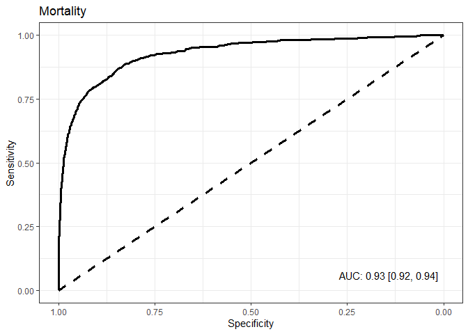<!-- -->

``` r
roc_ci(testing_tbl_preds, aki, preds_aki, "Yes", title = "AKI")
```

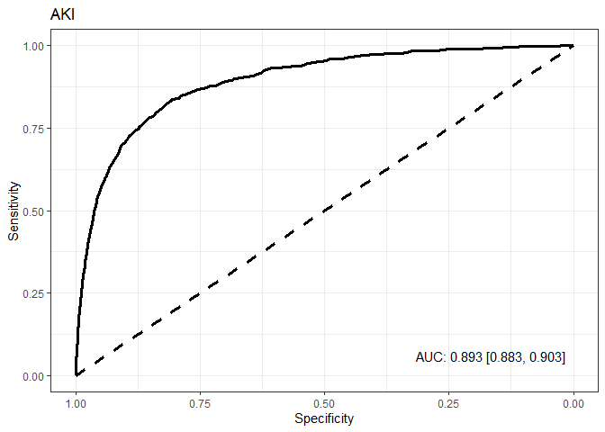<!-- -->

``` r
roc_ci(testing_tbl_preds, any_stroke, preds_any_stroke, "Yes", title = "Any Stroke")
```

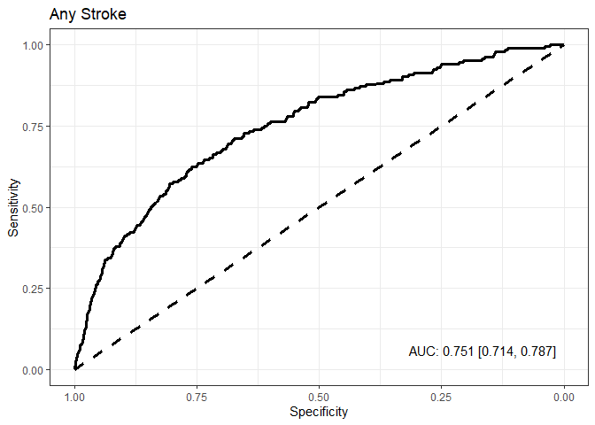<!-- -->

``` r
roc_ci(testing_tbl_preds, major_bleeding, preds_major_bleeding, "Yes", title = "Major Bleeding")
```

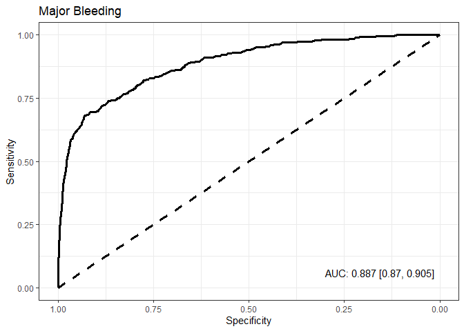<!-- -->

``` r
roc_ci(testing_tbl_preds, transfusion, preds_transfusion, "Yes", title = "Transfusion")
```

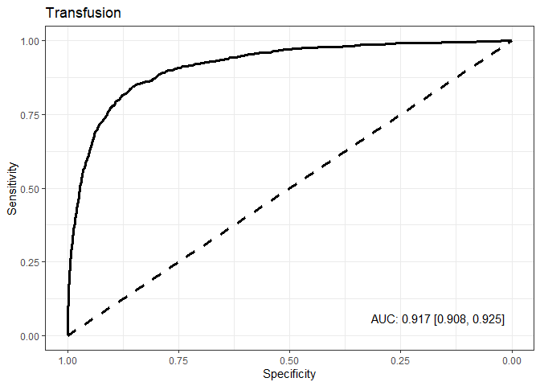<!-- -->

``` r
roc_ci(testing_tbl_preds, nrd, preds_nrd, "Yes", title = "NRD")
```

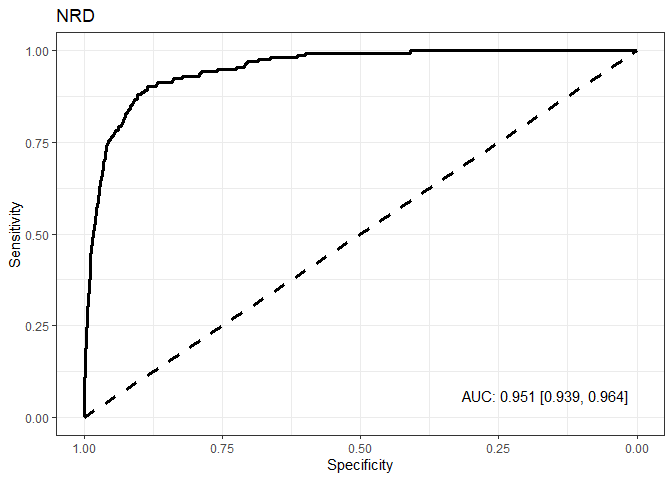<!-- -->

``` r
roc_ci(testing_tbl_preds, new_cabg, preds_new_cabg, "Yes", title = "New CABG")
```

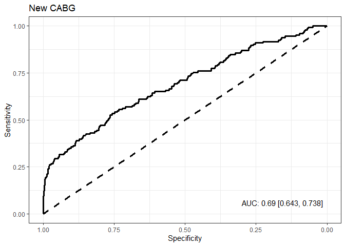<!-- -->

## Model Performance by Subgroups

``` r
testing_n_auc <- bind_rows(
  auc_by_group(testing_tbl_preds, mortality, preds_mortality, "Yes", title = "Mortality"),
  auc_by_group(testing_tbl_preds, aki, preds_aki, "Yes", title = "AKI"),
  auc_by_group(testing_tbl_preds, any_stroke, preds_any_stroke, "Yes", title = "Any Stroke"),
  auc_by_group(testing_tbl_preds, major_bleeding, preds_major_bleeding, "Yes", title = "Major Bleeding"),
  auc_by_group(testing_tbl_preds, transfusion, preds_transfusion, "Yes", title = "Transfusion"),
  auc_by_group(testing_tbl_preds, nrd, preds_nrd, "Yes", title = "NRD"),
  auc_by_group(testing_tbl_preds, new_cabg, preds_new_cabg, "Yes", title = "New CABG")
)

testing_n_auc %>% 
  kable()
```

| Outcome        | Sample            | N      | AUC                    |
|:---------------|:------------------|:-------|:-----------------------|
| Mortality      | All Data          | 43,118 | 0.93 \[0.92, 0.94\]    |
| Mortality      | Female            | 13,725 | 0.912 \[0.893, 0.93\]  |
| Mortality      | Age \> 70         | 16,876 | 0.913 \[0.898, 0.929\] |
| Mortality      | STEMI             | 6,926  | 0.9 \[0.883, 0.916\]   |
| Mortality      | Cardiogenic Shock | 997    | 0.757 \[0.725, 0.788\] |
| Mortality      | NSTE - ACS        | 17,623 | 0.898 \[0.876, 0.919\] |
| AKI            | All Data          | 41,776 | 0.893 \[0.883, 0.903\] |
| AKI            | Female            | 13,143 | 0.892 \[0.875, 0.909\] |
| AKI            | Age \> 70         | 16,464 | 0.877 \[0.863, 0.891\] |
| AKI            | STEMI             | 6,897  | 0.851 \[0.831, 0.872\] |
| AKI            | Cardiogenic Shock | 914    | 0.71 \[0.673, 0.747\]  |
| AKI            | NSTE - ACS        | 16,849 | 0.877 \[0.861, 0.893\] |
| Any Stroke     | All Data          | 43,118 | 0.751 \[0.714, 0.787\] |
| Any Stroke     | Female            | 13,715 | 0.719 \[0.662, 0.775\] |
| Any Stroke     | Age \> 70         | 16,878 | 0.66 \[0.607, 0.714\]  |
| Any Stroke     | STEMI             | 7,036  | 0.76 \[0.704, 0.816\]  |
| Any Stroke     | Cardiogenic Shock | 958    | 0.422 \[0.316, 0.529\] |
| Any Stroke     | NSTE - ACS        | 17,435 | 0.718 \[0.662, 0.774\] |
| Major Bleeding | All Data          | 42,380 | 0.887 \[0.87, 0.905\]  |
| Major Bleeding | Female            | 13,527 | 0.829 \[0.796, 0.861\] |
| Major Bleeding | Age \> 70         | 16,572 | 0.878 \[0.85, 0.906\]  |
| Major Bleeding | STEMI             | 6,578  | 0.857 \[0.83, 0.885\]  |
| Major Bleeding | Cardiogenic Shock | 875    | 0.786 \[0.747, 0.824\] |
| Major Bleeding | NSTE - ACS        | 17,271 | 0.873 \[0.838, 0.908\] |
| Transfusion    | All Data          | 43,118 | 0.917 \[0.908, 0.925\] |
| Transfusion    | Female            | 13,715 | 0.883 \[0.866, 0.899\] |
| Transfusion    | Age \> 70         | 16,893 | 0.897 \[0.884, 0.91\]  |
| Transfusion    | STEMI             | 6,831  | 0.879 \[0.859, 0.899\] |
| Transfusion    | Cardiogenic Shock | 924    | 0.712 \[0.673, 0.751\] |
| Transfusion    | NSTE - ACS        | 17,761 | 0.903 \[0.888, 0.918\] |
| NRD            | All Data          | 41,776 | 0.951 \[0.939, 0.964\] |
| NRD            | Female            | 13,330 | 0.945 \[0.923, 0.966\] |
| NRD            | Age \> 70         | 16,353 | 0.928 \[0.904, 0.952\] |
| NRD            | STEMI             | 6,851  | 0.892 \[0.851, 0.932\] |
| NRD            | Cardiogenic Shock | 880    | 0.742 \[0.684, 0.8\]   |
| NRD            | NSTE - ACS        | 16,745 | 0.955 \[0.938, 0.972\] |
| New CABG       | All Data          | 43,118 | 0.69 \[0.643, 0.738\]  |
| New CABG       | Female            | 13,819 | 0.652 \[0.566, 0.738\] |
| New CABG       | Age \> 70         | 16,899 | 0.732 \[0.657, 0.808\] |
| New CABG       | STEMI             | 6,933  | 0.711 \[0.613, 0.809\] |
| New CABG       | Cardiogenic Shock | 929    | 0.874 \[0.811, 0.937\] |
| New CABG       | NSTE - ACS        | 17,457 | 0.659 \[0.584, 0.735\] |

## Calibration Accuracy

For these figures, it is important to mind the scale of the y-axis.

``` r
calibration_graph(testing_tbl_preds, mortality, preds_mortality, "Yes", quantiles = 10, title = "Mortality")
```

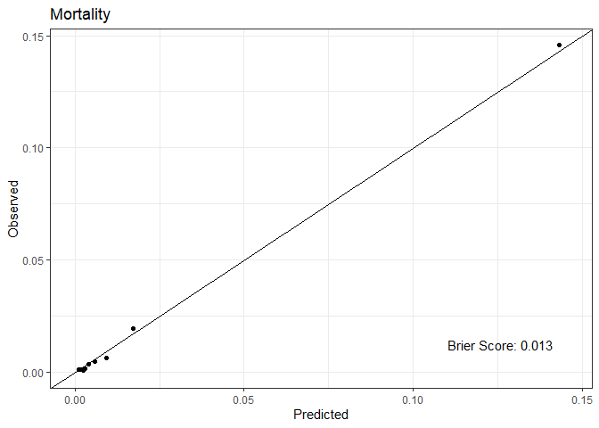<!-- -->

``` r
calibration_graph(testing_tbl_preds, aki, preds_aki, "Yes", quantiles = 10, title = "AKI")
```

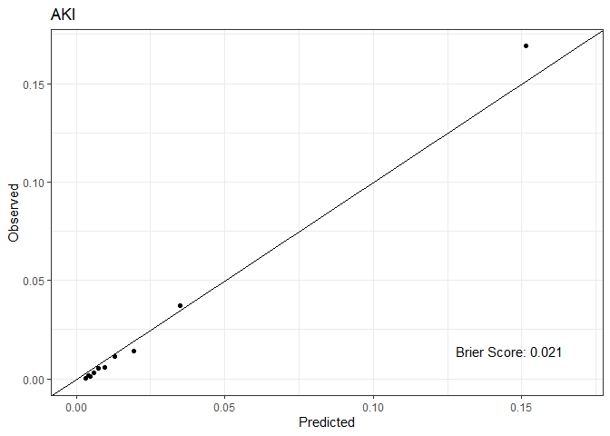<!-- -->

``` r
calibration_graph(testing_tbl_preds, any_stroke, preds_any_stroke, "Yes", quantiles = 10, title = "Any Stroke")
```

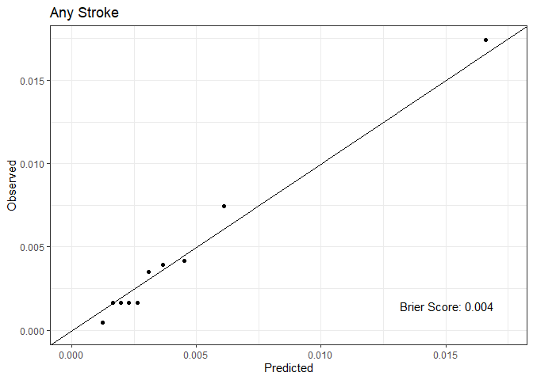<!-- -->

``` r
calibration_graph(testing_tbl_preds, major_bleeding, preds_major_bleeding, "Yes", quantiles = 10, title = "Major Bleeding")
```

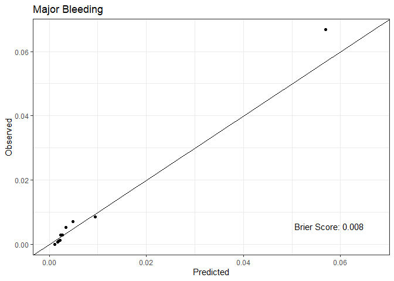<!-- -->

``` r
calibration_graph(testing_tbl_preds, transfusion, preds_transfusion, "Yes", quantiles = 10, title = "Transfusion")
```

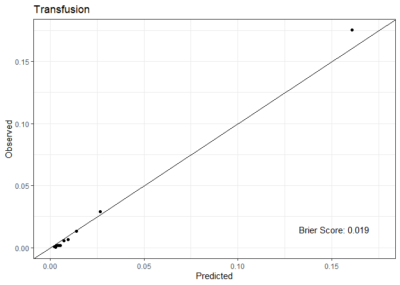<!-- -->

``` r
calibration_graph(testing_tbl_preds, nrd, preds_nrd, "Yes", quantiles = 10, title = "NRD")
```

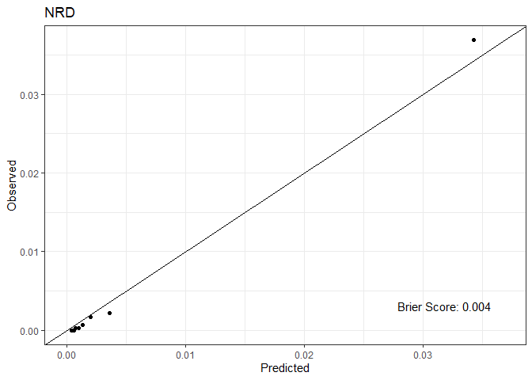<!-- -->

``` r
calibration_graph(testing_tbl_preds, new_cabg, preds_new_cabg, "Yes", quantiles = 10, title = "New CABG")
```

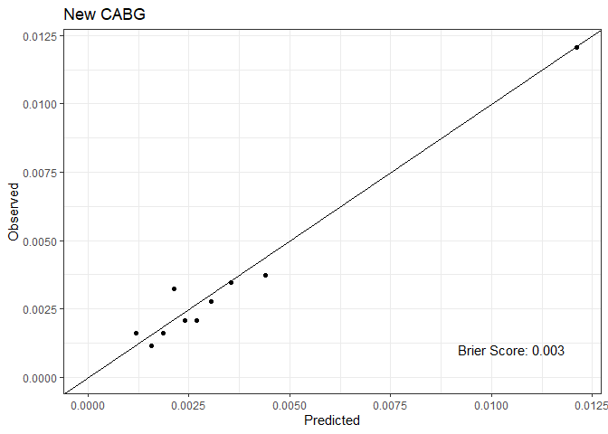<!-- -->

The following provides a sense of the discrepancies between predicted
and observed.

``` r
bind_rows(
  calibration_table(testing_tbl_preds, mortality, preds_mortality, "Yes", quantiles = 10, title = "Mortality") %>% mutate(Outcome = "Mortality"),
  calibration_table(testing_tbl_preds, aki, preds_aki, "Yes", quantiles = 10, title = "AKI") %>% mutate(Outcome = "AKI"),
  calibration_table(testing_tbl_preds, any_stroke, preds_any_stroke, "Yes", quantiles = 10, title = "Any Stroke") %>% mutate(Outcome = "Any Stroke"),
  calibration_table(testing_tbl_preds, major_bleeding, preds_major_bleeding, "Yes", quantiles = 10, title = "Major Bleeding") %>% mutate(Outcome = "Major Bleeding"),
  calibration_table(testing_tbl_preds, transfusion, preds_transfusion, "Yes", quantiles = 10, title = "Transfusion") %>% mutate(Outcome = "Transfusion"),
  calibration_table(testing_tbl_preds, nrd, preds_nrd, "Yes", quantiles = 10, title = "NRD") %>% mutate(Outcome = "NRD")
  ) %>% 
  select(
    Outcome,
    `Quantile` = qtile,
    Predicted = risk,
    Observed = obs,
  ) %>% 
  kable()
```

| Outcome        | Quantile | Predicted |  Observed |
|:---------------|---------:|----------:|----------:|
| Mortality      |        1 | 0.0012439 | 0.0009276 |
| Mortality      |        2 | 0.0016830 | 0.0009276 |
| Mortality      |        3 | 0.0019975 | 0.0011596 |
| Mortality      |        4 | 0.0024140 | 0.0004638 |
| Mortality      |        5 | 0.0030561 | 0.0016234 |
| Mortality      |        6 | 0.0041117 | 0.0032468 |
| Mortality      |        7 | 0.0059844 | 0.0046382 |
| Mortality      |        8 | 0.0091970 | 0.0062616 |
| Mortality      |        9 | 0.0172909 | 0.0192531 |
| Mortality      |       10 | 0.1430517 | 0.1456739 |
| AKI            |        1 | 0.0030639 | 0.0004787 |
| AKI            |        2 | 0.0039806 | 0.0019148 |
| AKI            |        3 | 0.0048338 | 0.0014361 |
| AKI            |        4 | 0.0059217 | 0.0028722 |
| AKI            |        5 | 0.0074593 | 0.0052657 |
| AKI            |        6 | 0.0095804 | 0.0059837 |
| AKI            |        7 | 0.0128623 | 0.0114915 |
| AKI            |        8 | 0.0193816 | 0.0143644 |
| AKI            |        9 | 0.0349441 | 0.0373474 |
| AKI            |       10 | 0.1513444 | 0.1690208 |
| Any Stroke     |        1 | 0.0012160 | 0.0004638 |
| Any Stroke     |        2 | 0.0016365 | 0.0016234 |
| Any Stroke     |        3 | 0.0019604 | 0.0016234 |
| Any Stroke     |        4 | 0.0022815 | 0.0016234 |
| Any Stroke     |        5 | 0.0026411 | 0.0016234 |
| Any Stroke     |        6 | 0.0030827 | 0.0034787 |
| Any Stroke     |        7 | 0.0036512 | 0.0039425 |
| Any Stroke     |        8 | 0.0045107 | 0.0041744 |
| Any Stroke     |        9 | 0.0060990 | 0.0074229 |
| Any Stroke     |       10 | 0.0166014 | 0.0173974 |
| Major Bleeding |        1 | 0.0011600 | 0.0000000 |
| Major Bleeding |        2 | 0.0017390 | 0.0007079 |
| Major Bleeding |        3 | 0.0020181 | 0.0009438 |
| Major Bleeding |        4 | 0.0021552 | 0.0011798 |
| Major Bleeding |        5 | 0.0023416 | 0.0028315 |
| Major Bleeding |        6 | 0.0027021 | 0.0028315 |
| Major Bleeding |        7 | 0.0033945 | 0.0051911 |
| Major Bleeding |        8 | 0.0048591 | 0.0070788 |
| Major Bleeding |        9 | 0.0094536 | 0.0084946 |
| Major Bleeding |       10 | 0.0569325 | 0.0667768 |
| Transfusion    |        1 | 0.0022992 | 0.0009276 |
| Transfusion    |        2 | 0.0029095 | 0.0004638 |
| Transfusion    |        3 | 0.0035682 | 0.0018553 |
| Transfusion    |        4 | 0.0043969 | 0.0016234 |
| Transfusion    |        5 | 0.0056285 | 0.0018553 |
| Transfusion    |        6 | 0.0072826 | 0.0057978 |
| Transfusion    |        7 | 0.0096099 | 0.0067254 |
| Transfusion    |        8 | 0.0139587 | 0.0132189 |
| Transfusion    |        9 | 0.0267460 | 0.0292276 |
| Transfusion    |       10 | 0.1608171 | 0.1751334 |
| NRD            |        1 | 0.0004314 | 0.0000000 |
| NRD            |        2 | 0.0004675 | 0.0000000 |
| NRD            |        3 | 0.0005177 | 0.0000000 |
| NRD            |        4 | 0.0006081 | 0.0000000 |
| NRD            |        5 | 0.0007518 | 0.0002393 |
| NRD            |        6 | 0.0009969 | 0.0002393 |
| NRD            |        7 | 0.0013623 | 0.0007182 |
| NRD            |        8 | 0.0020212 | 0.0016758 |
| NRD            |        9 | 0.0036309 | 0.0021547 |
| NRD            |       10 | 0.0342775 | 0.0368686 |

## Connect Calibration

``` r
connected_calibration(testing_tbl_preds, mortality, preds_mortality, "Yes", quantiles = 10, title = "Mortality")
```

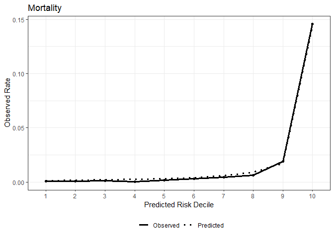<!-- -->

``` r
connected_calibration(testing_tbl_preds, aki, preds_aki, "Yes", quantiles = 10, title = "AKI")
```

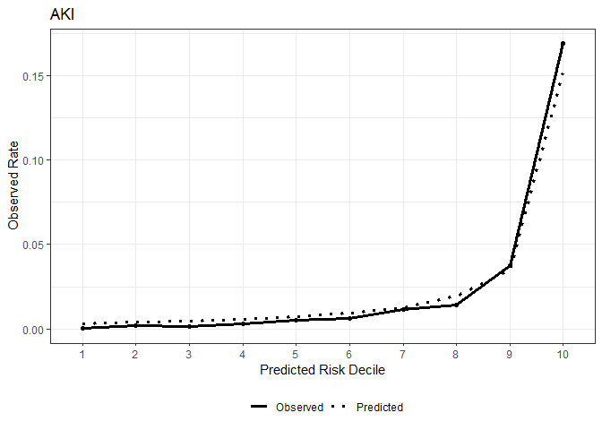<!-- -->

``` r
connected_calibration(testing_tbl_preds, any_stroke, preds_any_stroke, "Yes", quantiles = 10, title = "Any Stroke")
```

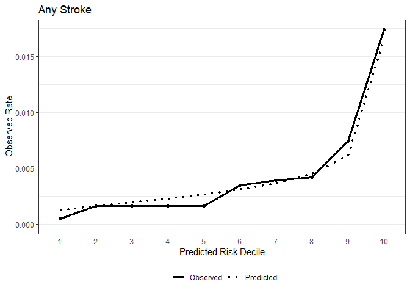<!-- -->

``` r
connected_calibration(testing_tbl_preds, major_bleeding, preds_major_bleeding, "Yes", quantiles = 10, title = "Major Bleeding")
```

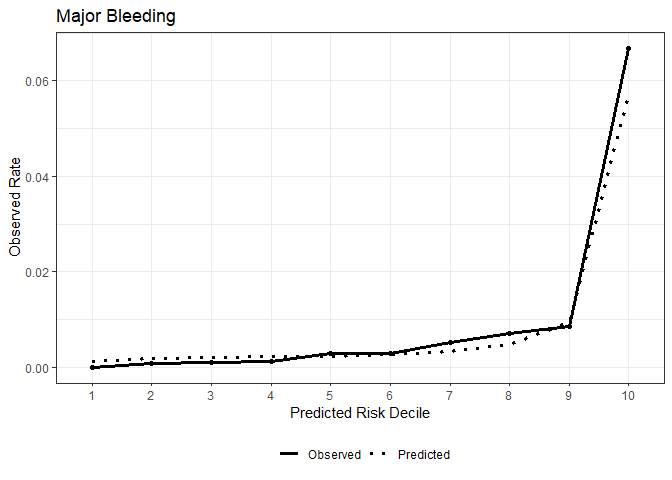<!-- -->

``` r
connected_calibration(testing_tbl_preds, transfusion, preds_transfusion, "Yes", quantiles = 10, title = "Transfusion")
```

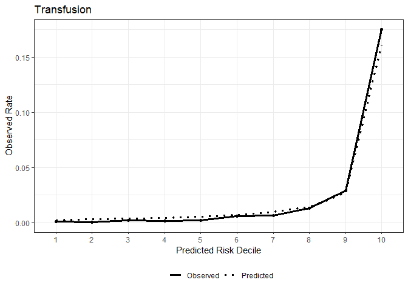<!-- -->

``` r
connected_calibration(testing_tbl_preds, nrd, preds_nrd, "Yes", quantiles = 10, title = "NRD")
```

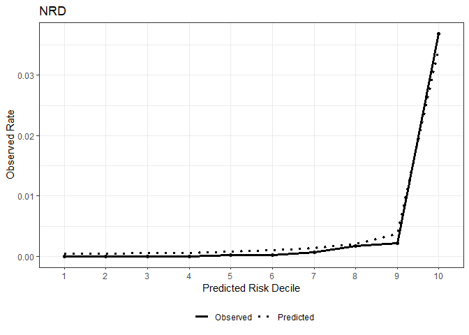<!-- -->

``` r
connected_calibration(testing_tbl_preds, new_cabg, preds_new_cabg, "Yes", quantiles = 10, title = "New CABG")
```

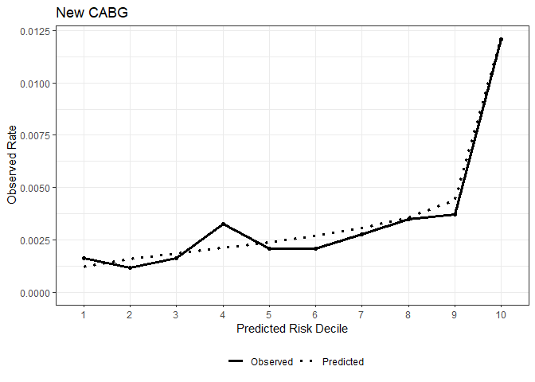<!-- -->
